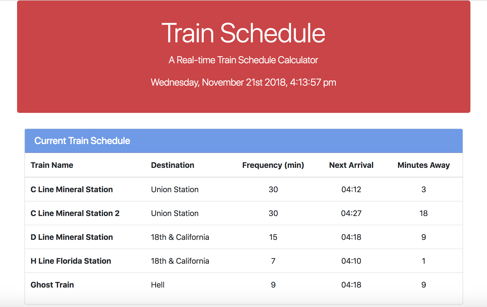

# train-schedule

### Overview

In this assignment, I had to create a dynamic train schedule that allows the user to view a list of trains, and have it calculate the next available train time (and it's minutes to arrivial) based on their current time using the moment.js framework. I also used a Google FireBase database for persistent storage and to allow all visitors to see the same list of trains, (or newly user added trains) simultaneously.

- - -

### Instructions
  
  * When adding trains, users are able to submit the following:
    
    * Train Name
    
    * Destination 
    
    * First Train Time -- in military time
    
    * Frequency -- in minutes
  
  * Code this app to calculate when the next train will arrive; this should be relative to the current time.
  
  * Users from many different machines must be able to view same train times.
  
  * Styling and theme are completely up to you. Get Creative!

### Bonus (Extra Challenges)

* Consider updating your "minutes to arrival" and "next train time" text once every minute. This is significantly more challenging; only attempt this if you've completed the actual activity and committed it somewhere on GitHub for safekeeping (and maybe create a second GitHub repo).

* Try adding `update` and `remove` buttons for each train. Let the user edit the row's elements-- allow them to change a train's Name, Destination and Arrival Time (and then, by relation, minutes to arrival).

* As a final challenge, make it so that only users who log into the site with their Google or GitHub accounts can use your site. You'll need to read up on Firebase authentication for this bonus exercise.

### Reminder: Submission on BCS

* Please submit both the deployed Github.io link to your homework AND the link to the Github Repository!